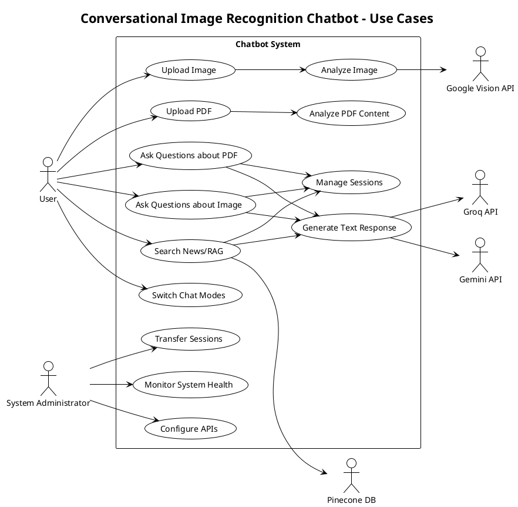
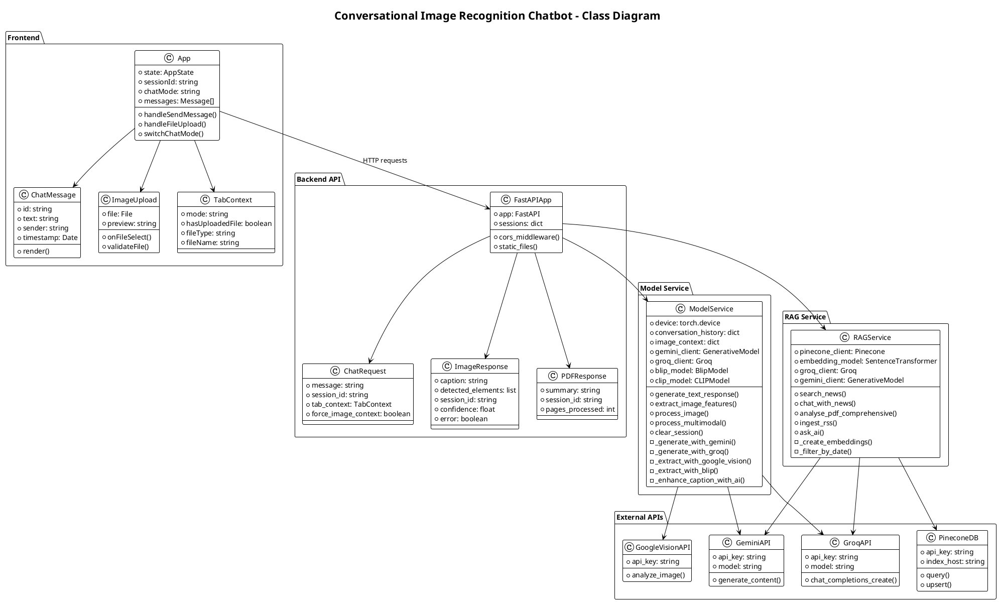
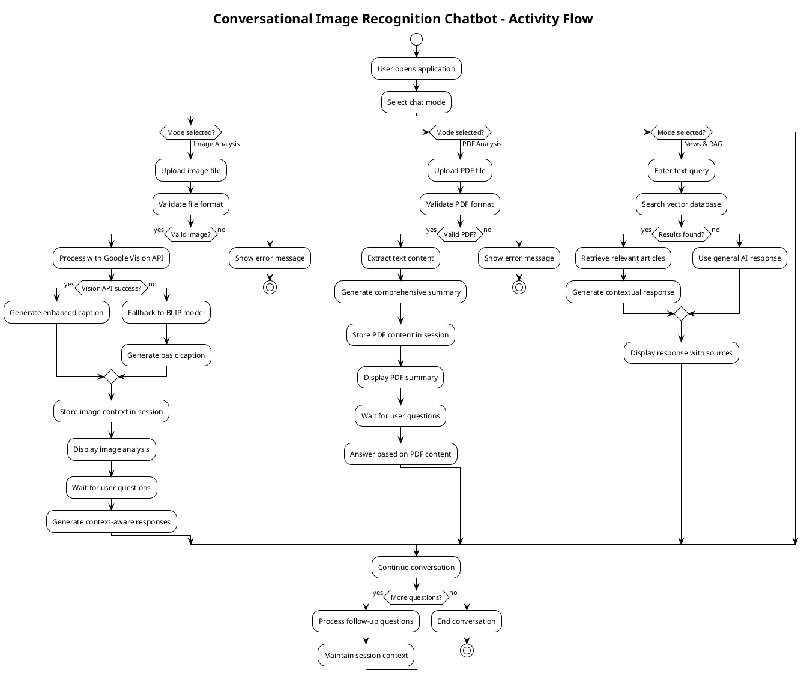
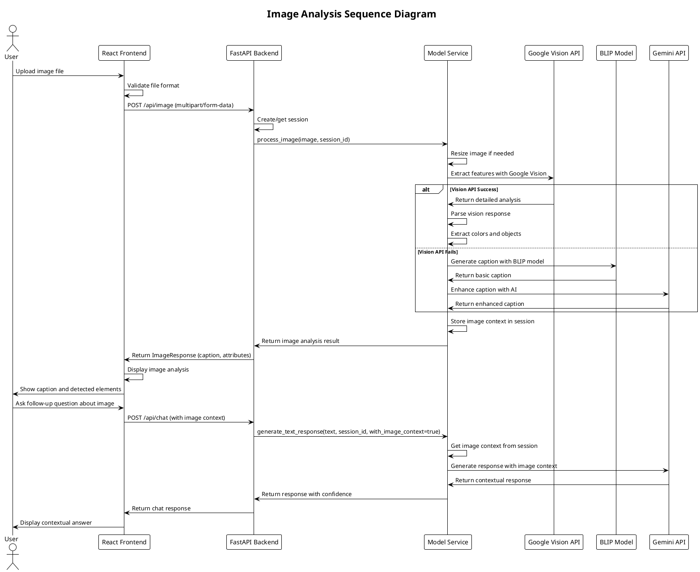
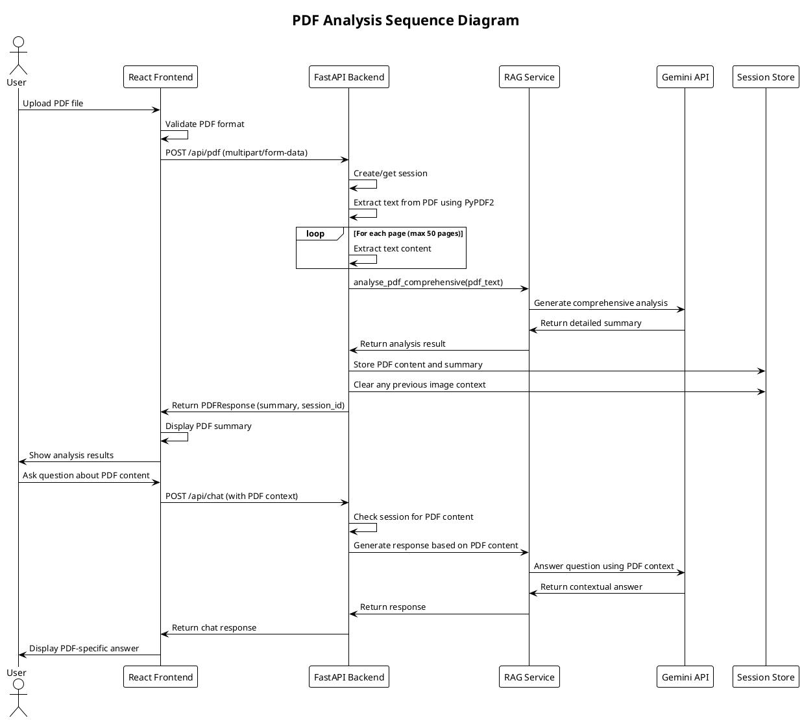
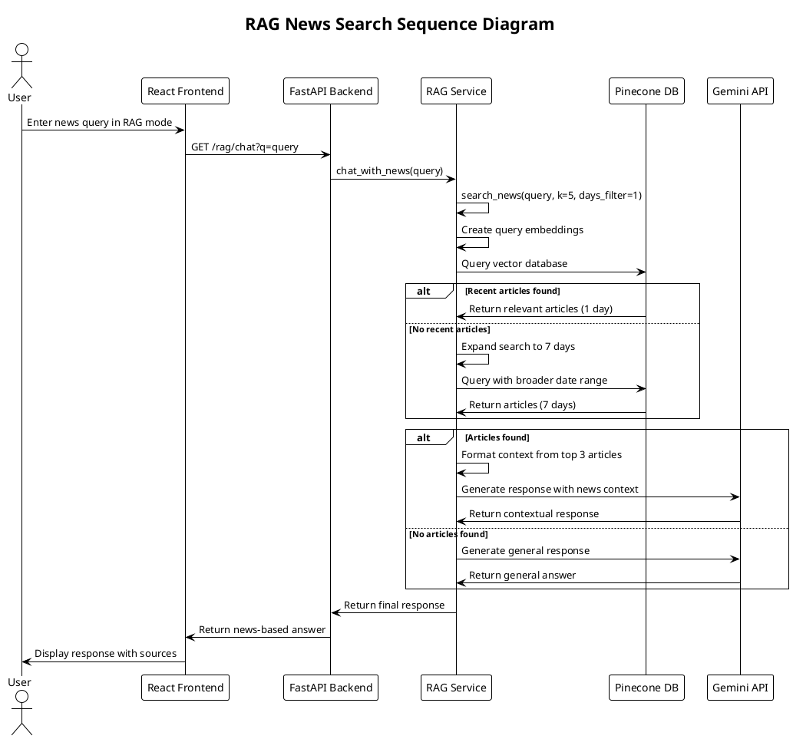

# 🎨 UML Diagrams Documentation
## Conversational Image Recognition Chatbot

### 📋 **Overview**
This document contains comprehensive UML diagrams for the multi-modal AI chatbot system including Use Case, Class, Activity, Deployment, and Sequence diagrams using PlantUML syntax.

**System Components:**
- **Frontend**: React Application (Port 8000)
- **Backend**: FastAPI Server (Port 3000)
- **AI Services**: Gemini API, Groq API, Google Vision API
- **Storage**: Pinecone Vector Database, Session Storage
- **Processing**: Image Analysis, PDF Processing, RAG System

---

## 🎯 **1. Use Case Diagram**



---

## 🏗️ **2. Class Diagram**



---

## 🔄 **3. Activity Diagram**



---

## 🧩 **4. Component Diagram**

```plantuml
@startuml Component_Chatbot
!theme plain
title Conversational Image Recognition Chatbot - Component Architecture

package "Frontend Layer" {
  component [React App] as ReactApp {
    component [Chat Interface] as ChatUI
    component [Image Upload] as ImageUpload
    component [PDF Upload] as PDFUpload
    component [Tab Manager] as TabManager
    component [Message Display] as MessageDisplay
    component [Loading Indicators] as LoadingUI
  }

  component [HTTP Client] as HTTPClient
  component [Session Manager] as SessionMgr
  component [File Validator] as FileValidator
}

package "API Gateway Layer" {
  component [FastAPI Server] as FastAPI {
    component [CORS Middleware] as CORS
    component [Static Files] as StaticFiles
    component [Request Router] as Router
    component [Response Handler] as ResponseHandler
  }

  component [Session Storage] as SessionStore
  component [File Handler] as FileHandler
}

package "Business Logic Layer" {
  component [Model Service] as ModelService {
    component [Text Generator] as TextGen
    component [Image Processor] as ImageProc
    component [Context Manager] as ContextMgr
    component [API Fallback] as APIFallback
  }

  component [RAG Service] as RAGService {
    component [Vector Search] as VectorSearch
    component [PDF Analyzer] as PDFAnalyzer
    component [News Aggregator] as NewsAgg
    component [Embedding Generator] as EmbedGen
  }
}

package "AI Processing Layer" {
  component [Gemini Client] as GeminiClient
  component [Groq Client] as GroqClient
  component [Google Vision Client] as VisionClient

  component [Local Models] as LocalModels {
    component [BLIP Model] as BLIPModel
    component [CLIP Model] as CLIPModel
    component [ViT Model] as ViTModel
    component [SentenceTransformer] as STModel
  }
}

package "Data Layer" {
  component [Pinecone Vector DB] as PineconeDB
  component [RSS Feed Reader] as RSSReader
  component [File System] as FileSystem
  component [Memory Cache] as MemCache
}

package "External Services" {
  component [Gemini API] as GeminiAPI
  component [Groq API] as GroqAPI
  component [Google Vision API] as VisionAPI
  component [RSS Sources] as RSSSources
}

' Frontend connections
ReactApp --> HTTPClient : HTTP Requests
ReactApp --> SessionMgr : Session Management
ReactApp --> FileValidator : File Validation

HTTPClient --> FastAPI : REST API Calls

' API Gateway connections
FastAPI --> ModelService : Service Calls
FastAPI --> RAGService : Service Calls
FastAPI --> SessionStore : Session Data
FastAPI --> FileHandler : File Operations

' Business Logic connections
ModelService --> GeminiClient : Text Generation
ModelService --> GroqClient : Fallback Generation
ModelService --> VisionClient : Image Analysis
ModelService --> LocalModels : Local Processing

RAGService --> PineconeDB : Vector Operations
RAGService --> GeminiClient : AI Generation
RAGService --> GroqClient : Fallback AI
RAGService --> LocalModels : Embeddings

' AI Processing connections
GeminiClient --> GeminiAPI : API Calls
GroqClient --> GroqAPI : API Calls
VisionClient --> VisionAPI : API Calls

' Data Layer connections
PineconeDB --> MemCache : Caching
RSSReader --> RSSSources : Data Ingestion
FileHandler --> FileSystem : File Storage

' Internal component relationships
TextGen --> APIFallback : Error Handling
ImageProc --> ContextMgr : Context Storage
VectorSearch --> EmbedGen : Embedding Creation
PDFAnalyzer --> NewsAgg : Content Processing

@enduml
```

---

## 🚀 **5. Deployment Diagram**

```plantuml
@startuml Deployment_Chatbot
!theme plain
title Conversational Image Recognition Chatbot - Deployment Architecture

node "Client Browser" {
  component "React Frontend" as frontend {
    port "Port 8000" as p8000
  }
}

node "Application Server" {
  component "FastAPI Backend" as backend {
    port "Port 3000" as p3000
  }

  component "Model Service" as models {
    artifact "BLIP Model"
    artifact "CLIP Model"
    artifact "ViT Model"
  }

  component "RAG Service" as rag {
    artifact "SentenceTransformer"
    artifact "PDF Parser"
  }
}

cloud "External APIs" {
  component "Gemini API" as gemini
  component "Groq API" as groq
  component "Google Vision API" as vision
}

cloud "Vector Database" {
  database "Pinecone" as pinecone {
    artifact "News Embeddings"
    artifact "RSS Data"
  }
}

cloud "RSS Feeds" {
  component "News Sources" as rss
}

node "Local Storage" {
  database "Session Store" as sessions
  folder "Generated Images" as images
  folder "Uploaded Files" as uploads
}

' Connections
frontend -down-> backend : HTTP/REST API
backend -down-> models : Local Processing
backend -down-> rag : Document Analysis
backend -right-> gemini : AI Generation
backend -right-> groq : Fallback AI
backend -right-> vision : Image Analysis
backend -down-> sessions : Session Management
backend -down-> images : File Storage
backend -down-> uploads : File Storage
rag -right-> pinecone : Vector Search
rag -up-> rss : Data Ingestion

' Protocols
frontend : HTTPS
backend : REST API
gemini : HTTPS/API
groq : HTTPS/API
vision : HTTPS/API
pinecone : HTTPS/gRPC

@enduml
```

---

## 📋 **6. Sequence Diagram - Image Analysis Flow**



---

## 📄 **7. Sequence Diagram - PDF Analysis Flow**



---

## 🔍 **8. Sequence Diagram - RAG News Search Flow**



---

## 📊 **UML Diagrams Summary**

### **Diagram Overview**

| Diagram Type | Purpose | Key Components | Complexity |
|--------------|---------|----------------|------------|
| **Use Case** | System functionality from user perspective | 13 use cases, 6 actors | Medium |
| **Class** | System structure and relationships | 15+ classes across 5 packages | High |
| **Activity** | Business process flow | 3 main workflows, decision points | Medium |
| **Component** | System architecture and component relationships | 6 layers, 25+ components | High |
| **Deployment** | Physical architecture and infrastructure | 7 nodes, multiple protocols | High |
| **Sequence** | Interaction flows over time | 3 detailed scenarios | High |

### **Key Architectural Patterns**

1. **Microservices Architecture**: Separate Model Service and RAG Service
2. **API Gateway Pattern**: FastAPI as central routing hub
3. **Fallback Pattern**: Multiple AI APIs with graceful degradation
4. **Session Management**: Stateful conversation handling
5. **Multi-modal Processing**: Unified interface for different input types

### **Technology Stack Visualization**

- **Frontend**: React (Port 8000) → User Interface
- **Backend**: FastAPI (Port 3000) → API Gateway
- **AI Services**: Gemini (Primary), Groq (Fallback) → Text Generation
- **Vision**: Google Vision API, BLIP Model → Image Analysis
- **Storage**: Pinecone Vector DB → RAG System
- **Processing**: Local ML Models → Offline Capabilities

### **Data Flow Patterns**

1. **Image Flow**: Upload → Vision API → Context Storage → Q&A
2. **PDF Flow**: Upload → Text Extraction → Analysis → Q&A
3. **RAG Flow**: Query → Vector Search → Context Generation → Response

---

*Generated for Conversational Image Recognition Chatbot v2.0.0*
*UML Documentation Version: 1.0*
